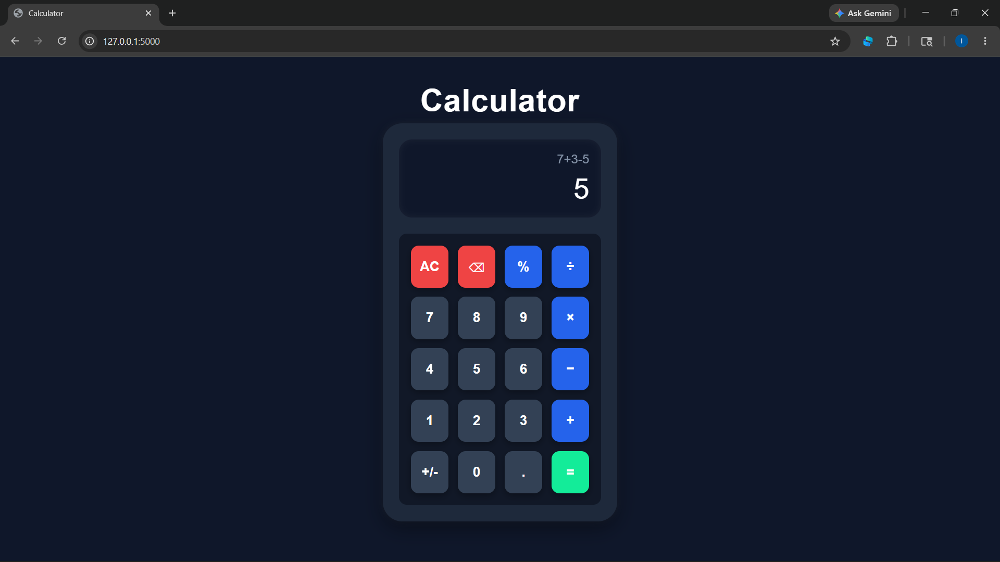

# Professional UI Calculator

A professional calculator web application developed using Python Flask, HTML, and CSS.  
This calculator performs basic arithmetic operations with a clean and modern mobile-style user interface.

---

## Features

- Addition
- Subtraction
- Multiplication
- Division
- Percentage Calculation
- Positive / Negative Toggle (+/-)
- Clear All Button
- Backspace Button
- Expression Display
- Result Display
- Professional Dark UI Design

---

## Technologies Used

- Python
- Flask
- HTML5
- CSS3

---
# GitHub Repository

https://github.com/ishaa-305/Calculator

---

## Project Screenshot



---

## How to Run the Project

1. Install Flask

```bash
pip install flask
```

2. Run the application

```bash
python app.py
```

3. Open browser and visit

```plaintext
http://127.0.0.1:5000
```

---

## Author

Isha Dwivedi